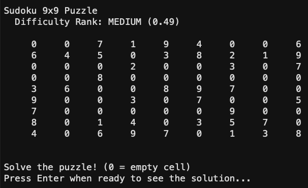

# Sudoku Game — MATLAB

A fully functional Sudoku game built in MATLAB featuring multiple grid sizes,
automatic puzzle generation, difficulty settings, and a built-in solver.

## Features
- Multiple grid sizes: 4x4, 9x9, and 16x16
- Automatic puzzle generation using backtracking algorithm
- Three difficulty levels: Easy, Medium, Hard
- Built-in solution display
- Difficulty ranking system

## How to Run
1. Open MATLAB
2. Navigate to the sudoku folder
3. Run `play` in the command window
4. Follow the on-screen prompts to select grid size and difficulty

## Files
- `play.m` — Main game entry point
- `genS.m` — Puzzle generator (backtracking algorithm)
- `set_difficulty.m` — Removes cells based on difficulty level
- `sudoku_difficulty.m` — Calculates and displays difficulty rank
- `subrule.m` — Validates subsquare constraints
- `rowrule.m` — Validates row/column constraints
- `possibS.m` — Finds valid number possibilities for each cell
- `solve_sudoku.m` — Solver logic

## Example Gameplay

### Generated Puzzle 

### Solved Puzzle 

## Requirements
MATLAB R2019b or later recommended.
Originally developed in GNU Octave — ported to full MATLAB compatibility.

## Development Notes
This project was originally written in GNU Octave and has been fully
ported to MATLAB, including fixing cell array type handling, comment
syntax, anonymous function indexing, and replacing a recursive
backtracking generation algorithm for improved performance.
